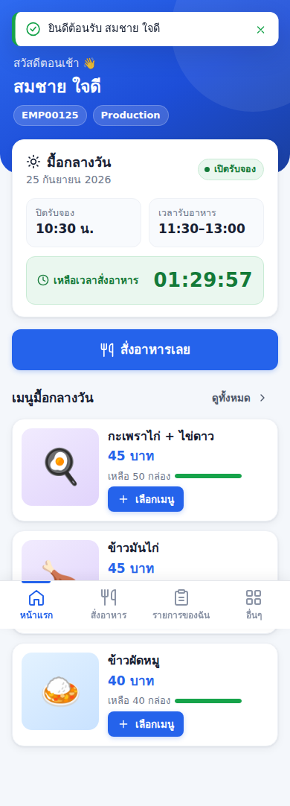
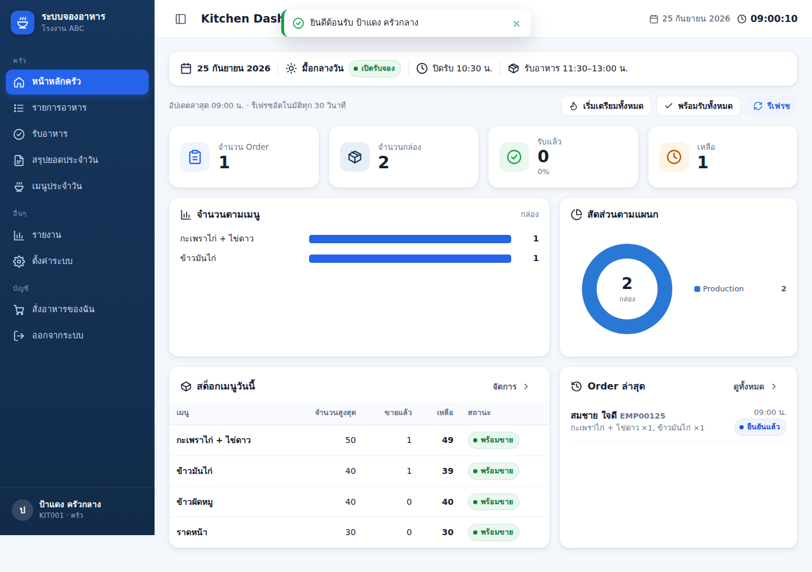
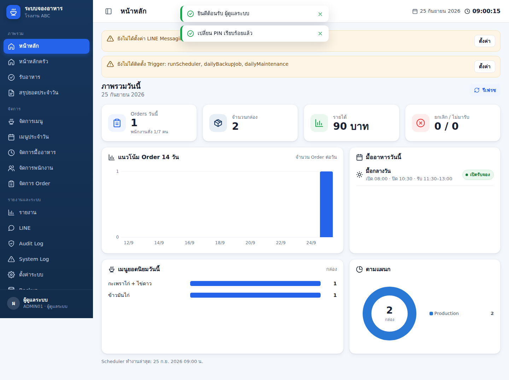

# 🍱 Factory Food Ordering System

ระบบจองอาหารสำหรับโรงงาน (พนักงาน 100–200 คน, 20–100 Orders/วัน) ที่ทำงานบน
**Google Apps Script Web App + Google Sheets** และแจ้งเตือนครัวผ่าน **LINE Official Account (Messaging API)**

- พนักงานสั่งอาหารผ่านมือถือ (Mobile-first) ด้วยรหัสพนักงาน + PIN
- ครัวดูยอด เปลี่ยนสถานะ และยืนยันรับอาหารผ่าน Tablet/Desktop
- Admin จัดการเมนู มื้ออาหาร พนักงาน รายงาน LINE Backup และ Log
- ไม่มีค่า Server — ใช้ Google Workspace/Gmail ที่มีอยู่

| พนักงาน (มือถือ) | ครัว (Desktop/Tablet) | Admin |
|---|---|---|
|  |  |  |

ภาพหน้าจอทั้งหมดอยู่ใน [`docs/screenshots/`](docs/screenshots/)

---

## 1. Architecture

```
Employee Mobile / Kitchen Tablet / Admin Desktop
        │  google.script.run.api(action, payload, token)
        ▼
Google Apps Script Web App ── Router.gs (session + RBAC + standard response)
        │
        ├── Auth / Session / Security         (PIN hash, token, rate-limit)
        ├── Employee / Meal / Menu / Order     (business rules, LockService)
        ├── Kitchen / Report / Admin
        ├── Notification (queue) ──► LineService ──► LINE Messaging API
        ├── Backup ──► Google Drive (FoodFactory-Backup/YYYY/MM/)
        └── Trigger (scheduler every N min, daily backup, maintenance)
        │
        ▼
Google Sheets Database (15 sheets: 01_CONFIG … 15_SYSTEM_LOG)
```

หลักการสำคัญ

- **Server เป็นผู้ตัดสินทุกอย่าง** — ราคา, สต็อก, เวลา cutoff, role, สถานะ ถูกตรวจที่ server เสมอ (client ส่งแค่ `daily_menu_id` + `qty`)
- **LockService** ครอบทุก critical transaction (สร้าง/แก้/ยกเลิก Order, สต็อก, Pickup) → ไม่มีวันขายเกิน 50/50
- **Idempotency** — ทุก `order.create` มี `request_token` (UUID) ส่งซ้ำ = ได้ Order เดิม
- **Critical vs Secondary** — Order สำเร็จก่อนเสมอ แล้วจึงเข้า Notification Queue; LINE/Report/Backup ล่มไม่กระทบการสั่งอาหาร
- **Single RPC endpoint** — `api(action, payload, token)` → `{ success, data, message, requestId }` หรือ `{ success:false, error:{code,message}, requestId }`

## 2. Features

| กลุ่ม | ความสามารถ |
|---|---|
| Login | รหัสพนักงาน + PIN, Show/Hide PIN, จำฉันไว้, ลืม PIN (แจ้ง Admin ผ่าน LINE), Rate limit, Lockout, บังคับเปลี่ยน PIN ครั้งแรก, Session timeout, Logout |
| พนักงาน | หน้าแรก + Countdown จริง (sync เวลา server), เมนูพร้อมรูป/สต็อก, รายละเอียดเมนู + หมายเหตุ (chip), ตะกร้าหลายเมนู, ยืนยัน Order, หน้า Success + QR, รายการของฉัน (วันนี้/ย้อนหลัง), แก้ไข/ยกเลิกก่อนปิดรอบ, เปลี่ยน PIN |
| ครัว | Dashboard KPI + กราฟตามเมนู + Donut ตามแผนก + สต็อก, รายการ Order (filter/search/pagination/bulk), รับอาหาร (สแกน QR ด้วยเครื่องสแกน/กล้อง, ป้องกันรับซ้ำ), สรุปยอดประจำวัน (พิมพ์ได้/ส่ง LINE), เปิด/ปิดการขายเมนู |
| Admin | Dashboard + Health check, Menu Master (เพิ่ม/แก้/เปิดปิด/Soft delete/Upload รูป), Daily Menu (ราคา/สต็อกรายวัน), Meal Windows (อัตโนมัติ/กำหนดเอง), พนักงาน (เพิ่ม/แก้/Disable/Enable/Reset PIN/Import CSV), จัดการ Order, รายงาน + Export CSV, LINE + Queue + Retry, Audit Log, Error/System Log, Settings, Triggers, Backup |
| Viewer | Dashboard + รายงาน (อ่านอย่างเดียว) |
| Automation | สร้างมื้อ + Daily Menu อัตโนมัติ, เปิด/ปิดรับตามเวลา, สรุป LINE ทุก 30 นาที, Final summary ตอนปิดรอบ, NO_SHOW อัตโนมัติ, Daily backup, ล้าง session |

## 3. Roles

| Role | สิทธิ์ |
|---|---|
| `EMPLOYEE` | สั่งอาหาร / แก้ไข / ยกเลิก / ดูประวัติของตัวเอง |
| `KITCHEN` | + Kitchen Dashboard, รายการ Order, เปลี่ยนสถานะ, รับอาหาร, สรุปยอด, เปิด/ปิดขายเมนูประจำวัน, รายงาน |
| `ADMIN` | ทุกอย่าง |
| `VIEWER` | Dashboard + รายงาน (แก้ไขไม่ได้) |

ทุก role สามารถสั่งอาหารของตัวเองได้ (ปุ่ม "สั่งอาหารของฉัน") — ตรวจสิทธิ์ที่ `Router.gs` ทุกคำขอ (role อ่านจากข้อมูลพนักงานปัจจุบัน ไม่เชื่อ client)

## 4. File Structure

```
src/                      ← Apps Script project (rootDir สำหรับ clasp)
  appsscript.json         manifest (V8, Asia/Bangkok, Web App)
  Config.gs               schema 15 sheets, roles, statuses, error codes, default config
  Main.gs                 doGet/doPost, setupDatabase, setupFirstAdmin, seedSampleData
  Router.gs               api(): route table + RBAC + response format
  Auth.gs  Session.gs  Security.gs  Validation.gs
  Database.gs             Sheets data layer (batch read/write, TextFinder, memo, lock)
  EmployeeService.gs  MealService.gs  MenuService.gs  OrderService.gs
  KitchenService.gs  AdminService.gs  ReportService.gs
  LineService.gs  NotificationService.gs  AuditService.gs
  BackupService.gs  TriggerService.gs  Utils.gs
  index.html              HTML shell (includes below)
  styles.html             design system (CSS)
  components.html         showLoading/showToast/confirmModal/apiCall/format*/charts/icons
  scripts.html            App core, session, desktop shell (sidebar)
  login.html  employee.html  kitchen.html  admin.html
tests/
  gas-mock.js             in-memory Apps Script emulator (Sheets/Cache/Lock/…)
  backend.test.js         backend tests (node --test)
  dev-server.js           run the real UI locally against the emulator
  e2e.js                  Playwright UI test (mobile + desktop)
docs/screenshots/         UI screenshots
README.md  DEPLOYMENT.md  DATABASE_SCHEMA.md  LINE_SETUP.md
TEST_CHECKLIST.md  CHANGELOG.md  DELIVERY_REPORT.md
```

## 5. Database

Google Sheet 1 ไฟล์ มี 15 ชีต (สร้างอัตโนมัติด้วย `setupDatabase()`) — รายละเอียดทุกคอลัมน์ดู [DATABASE_SCHEMA.md](DATABASE_SCHEMA.md)

`01_CONFIG · 02_EMPLOYEES · 03_USER_SESSIONS · 04_MEAL_WINDOWS · 05_MENU_ITEMS · 06_DAILY_MENU · 07_ORDERS · 08_ORDER_ITEMS · 09_ORDER_STATUS_LOG · 10_NOTIFICATION_QUEUE · 11_AUDIT_LOG · 12_PAYMENT · 13_DAILY_SUMMARY · 14_ERROR_LOG · 15_SYSTEM_LOG`

## 6. Setup (สรุป — ขั้นตอนละเอียดใน [DEPLOYMENT.md](DEPLOYMENT.md))

1. สร้าง Google Sheet ใหม่ → Extensions → Apps Script
2. คัดลอกไฟล์ทั้งหมดใน `src/` เข้าโปรเจกต์ (หรือใช้ `clasp push`)
3. Project Settings → Script Properties: `INIT_ADMIN_ID`, `INIT_ADMIN_NAME`, `INIT_ADMIN_PIN` (+ LINE ถ้ามี)
4. Run `setupDatabase()` → `setupFirstAdmin()` → (ถ้าต้องการ demo) `seedSampleData()` → `setupTriggers()`
5. Deploy → New deployment → Web app (Execute as: **Me**, Who has access: **Anyone**)
6. เปิด URL → Login ด้วย Admin → เปลี่ยน PIN → สร้างเมนู → ใช้งาน

### Script Properties

| Key | จำเป็น | คำอธิบาย |
|---|---|---|
| `DATABASE_SHEET_ID` | อัตโนมัติ | ID ของ Google Sheet (ตั้งเองเมื่อใช้แบบ standalone script) |
| `APP_SECRET` | อัตโนมัติ | ใช้ hash session token (สร้างเองครั้งแรก) |
| `PIN_SALT` | อัตโนมัติ | pepper สำหรับ hash PIN (สร้างเองครั้งแรก — **ห้ามเปลี่ยน** ไม่งั้น PIN เดิมใช้ไม่ได้) |
| `LINE_CHANNEL_ACCESS_TOKEN` | สำหรับ LINE | Channel access token (long-lived) |
| `LINE_CHANNEL_SECRET` | ไม่บังคับ | เก็บไว้สำหรับอนาคต |
| `LINE_TARGET_ID` | สำหรับ LINE | Group ID / User ID ที่รับข้อความ |
| `BACKUP_FOLDER_ID` | อัตโนมัติ | โฟลเดอร์ FoodFactory-Backup (สร้างเองถ้าไม่มี) |
| `IMAGE_FOLDER_ID` / `EXPORT_FOLDER_ID` | อัตโนมัติ | โฟลเดอร์รูปเมนู / ไฟล์ Export |
| `BASE_URL` | แนะนำ | URL ของ Web App (ใช้ในลิงก์ LINE) |
| `INIT_ADMIN_ID` / `INIT_ADMIN_NAME` / `INIT_ADMIN_PIN` | ตอนติดตั้ง | ข้อมูล Admin คนแรก (`INIT_ADMIN_PIN` ถูกลบอัตโนมัติหลังใช้) |

## 7. Initial Admin

ไม่มี PIN อยู่ใน source code — `setupFirstAdmin()` อ่านจาก Script Properties
(ถ้าไม่ใส่ `INIT_ADMIN_PIN` ระบบสุ่ม PIN และแสดงใน Execution log) และบังคับเปลี่ยน PIN ครั้งแรก
ลืม PIN Admin: ตั้ง `INIT_ADMIN_PIN` ใหม่แล้วรัน `resetAdminPin()`

## 8. LINE Setup

ใช้ **LINE Messaging API** (ไม่ใช่ LINE Notify ซึ่งปิดบริการแล้ว) — ดู [LINE_SETUP.md](LINE_SETUP.md)
โหมด: `SUMMARY` (ค่าเริ่มต้น สรุปทุก 30 นาที) · `INSTANT` (ทุก Order) · `CUTOFF` (เฉพาะตอนปิดรอบ) — ทุกโหมดส่ง Final Summary ตอนปิดรอบ

## 9. Triggers

`setupTriggers()` (หรือปุ่มในหน้า Settings) ติดตั้ง 3 trigger:

| Handler | ความถี่ | หน้าที่ |
|---|---|---|
| `runScheduler` | ทุก `SCHEDULER_INTERVAL_MINUTES` (5) | สร้างมื้อวันนี้, DRAFT→OPEN→CLOSED→PREPARING→COMPLETED ตามเวลาของแต่ละมื้อ, Final summary, NO_SHOW, Summary ทุก 30 นาที, ส่ง/Retry คิว LINE |
| `dailyBackupJob` | ทุกวันเวลา `BACKUP_HOUR` (18:00) | Backup ไป Drive |
| `dailyMaintenance` | ทุกวัน 00:05 | ล้าง session หมดอายุ, ล้างตัวนับเลข Order เก่า |

เวลาเปิด/ปิด/รับอาหาร **ไม่ hardcode** — ตั้งค่าเริ่มต้นใน Settings และแก้รายมื้อได้ในหน้า "จัดการมื้ออาหาร"
การปิดรับ Order บังคับที่ server ตามเวลา `close_at` เสมอ แม้ trigger จะล่าช้า

## 10. Backup

`FoodFactory-Backup/YYYY/MM/FoodFactory-DB_YYYY-MM-DD_HHmmss` — สร้างไฟล์ใหม่ทุกครั้ง ไม่เขียนทับ
Backup ล้มเหลว → บันทึก Error Log + แจ้งเตือน LINE · Archive รายปี: `archiveOrdersByYear(2025)` (สำรองก่อนเสมอ)

## 11. Deploy

ดู [DEPLOYMENT.md](DEPLOYMENT.md) — รองรับทั้งการคัดลอกไฟล์ผ่าน Apps Script Editor และ `clasp push`

## 12. Testing

```bash
npm test            # backend tests (14 suites) บน Apps Script emulator
npm run test:e2e    # Playwright UI test (ต้องมี playwright + chromium)
npm run dev         # เปิด UI จริงที่ http://localhost:8080 กับ backend จำลอง (พิมพ์ PIN demo ใน console)
```

รายการทดสอบทั้งหมด: [TEST_CHECKLIST.md](TEST_CHECKLIST.md)

## 13. Troubleshooting

| อาการ | วิธีแก้ |
|---|---|
| "ระบบยังไม่ได้ตั้งค่าฐานข้อมูล" | รัน `setupDatabase()` / ตรวจ `DATABASE_SHEET_ID` |
| เข้าสู่ระบบไม่ได้ "บัญชีถูกล็อก" | รอ 15 นาที หรือ Admin กด Reset PIN |
| Admin ลืม PIN | ตั้ง `INIT_ADMIN_PIN` แล้วรัน `resetAdminPin()` |
| มื้ออาหารไม่เปิดเอง | ตรวจว่าติดตั้ง Trigger แล้ว (หน้า Settings) และมื้อเป็นโหมด "อัตโนมัติ" |
| LINE ไม่ส่ง | หน้า LINE → ดู Connection/Queue → `last_error` · Token/Target ถูกต้อง · บอทอยู่ในกลุ่ม |
| หน้าเว็บไม่อัปเดตหลังแก้โค้ด | ต้อง Deploy → Manage deployments → Edit → New version |
| ตัวเลขสต็อกไม่ตรงหลังแก้ชีตด้วยมือ | หน้าเมนูประจำวัน → "คำนวณสต็อกใหม่" |
| Export ดาวน์โหลดไม่ได้ | ใช้ปุ่ม "บันทึกไป Google Drive" |
| รหัส Error อื่น ๆ | หน้า System Log → Error Log (ค้นหาด้วย Request ID ที่แสดงใน response) |
